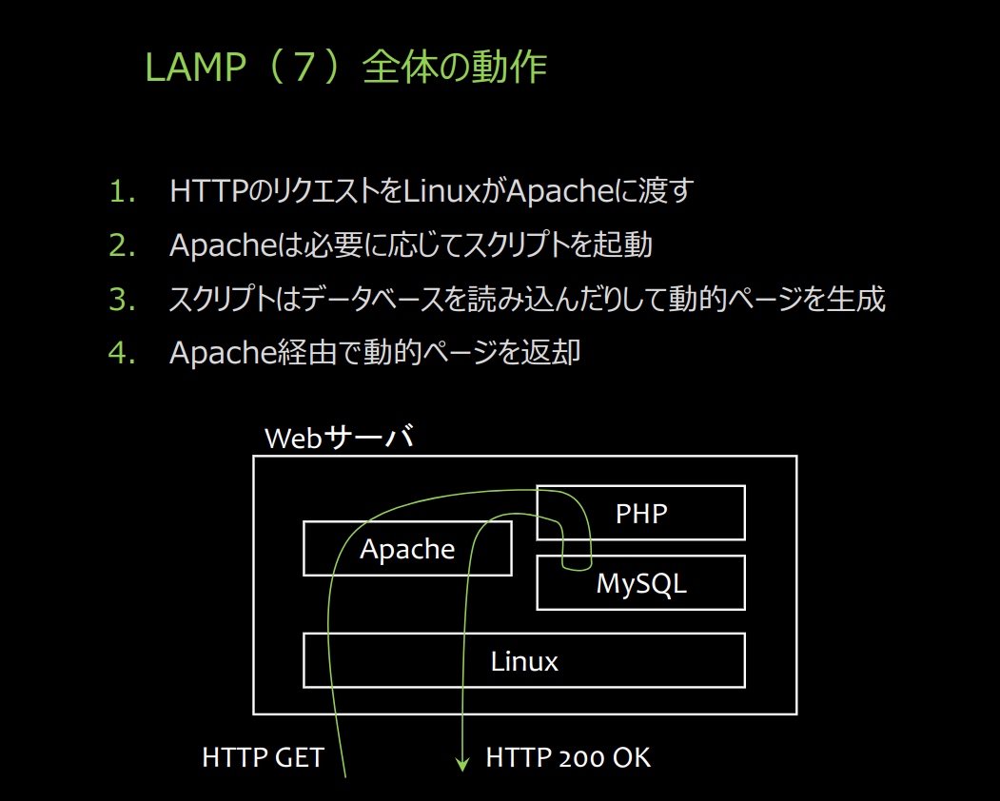
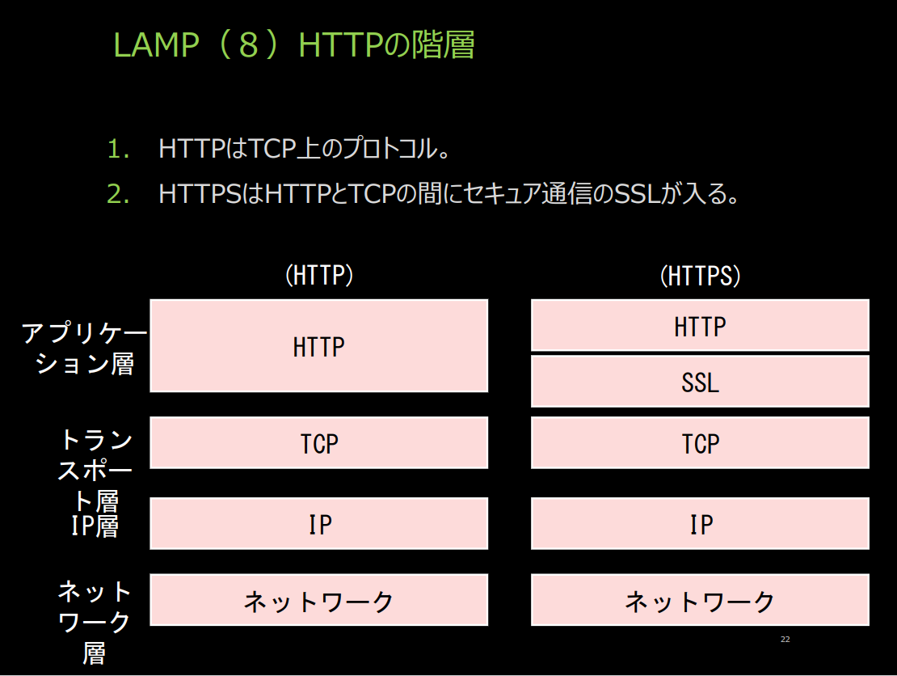
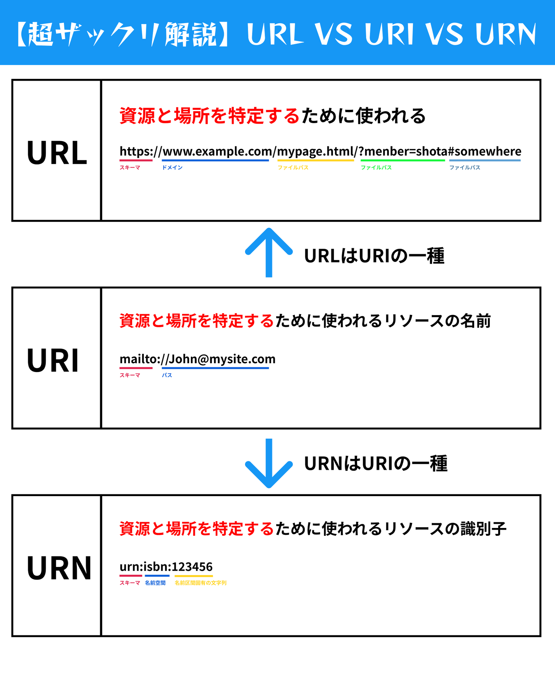

# サーバシステムテスト対策.md

### シラバス到達目標 :

## 第 01 回

### 講義概要

- Web アプリケーションの概念形成と、実践的なシステム構築。
- 複数の言語、複数の部品を組み合わせ、統合する能力の習得。
- 実践的な応用力の養成。

### 到達目標

- 学習した技術をベースとして、これらを統合した実践的な web 開発の皇帝を習得する所。
- システム開発の考え方、進め方などを知ること。
- システムエンジニアの仕事の工程を体験的に知り、即戦力としての基本能力を養成すること。

## 第 02 回

### Xrdp

- xrdp とは?
  - xrdp は、Microsoft RDP プロトコルのフリーかつオープンソースのサーバである。Apache License, Version 2.0 でライセンスされ、主に Linux で利用可能である。RDP によるグラフィカルログインを提供する。
  - Linux へのリモートデスクトップの接続を可能とするもの。

### Apache

- Apache とは?
  - オープンソースの Web サーバソフトウェア。HTTP サーバとして広く利用されており、高いカスタマイズ性と拡張性を持つ。

### Linux 基本コマンド・Bash Script について

- 基本コマンド

  - `ls` - ディレクトリの内容を一覧表示
  - `cd` - ディレクトリの移動
  - `cp` - ファイルやディレクトリをコピー
  - `mv` - ファイルやディレクトリを移動または名前を変更
  - `rm` - ファイルやディレクトリを削除
  - `chmod` - ファイルの権限を変更
  - `chown` - ファイルの所有者を変更
  - `ps` - 実行中のプロセスを表示
  - `grep` - 文字列検索
  - `find` - ファイル検索

- Bash Script
  - シェルスクリプトの基本構文
  ```bash
  #!/bin/bash
  echo "Hello, World!"
  ```

### Unicode と UTF-8 の違い

- Unicode
  - 世界中の文字を一意に表すための標準文字コード。
  - 各文字に対して一意の番号（コードポイント）を割り当てる。
- UTF-8
  - Unicode をエンコードするための可変長文字エンコーディング方式。
  - 1〜4 バイトで 1 つの文字を表す。

## 第 03 回

### LAMP

- LAMP とは?

  - Linux + Apache + MySQL + P 言語(php, perl, python 等) の頭文字を取ったもので、オープンソースソフトウェアを組み合わせた Web サービスの構築環境を指す。

- LAMP 全体の動作
  - 1. HTTP リクエストを Linux が Apache に渡す。(HTTP GET)
  - 2. Apache は必要に応じてスクリプトを実行。
  - 3. スクリプトはデータベースを読み込んだりして動的ページを作成。
  - 4. Apache 経由で動的ページを返却。(HTTP 200 OK)
       

### LAMP HTTP の階層

- HTTP と HTTPS の階層

  - HTTP は TCP 上のプロトコル
  - HTTPS は HTTP と TCP の間にセキュア通信の SSL が入る

  | 層                 | HTTP         | HTTPS        |
  | ------------------ | ------------ | ------------ |
  | アプリケーション層 | HTTP         | HTTP         |
  |                    |              | SSL          |
  | トランスポート層   | TCP          | TCP          |
  | IP 層              | IP           | IP           |
  | ネットワーク層     | ネットワーク | ネットワーク |

  

### 通信プロトコル

- 通信プロトコルの基本
  - 通信プロトコルとは、データ通信を行うためのルールセット。
  - 代表的なプロトコル：HTTP, FTP, SMTP, TCP/IP, UDP

## 第 04 回

### JavaScript

1. 変数 (let, const, var)
   |宣言の種類 | 再代入 |再宣言 | スコープ |
   | - | - | - |- |
   |const | NG | NG | ブロック |
   |let | NG | OK | ブロック |
   |var | OK | OK | 関数 |

2. if 文

   ```js
   if (条件) {
     // 条件が真の場合の処理
   } else {
     // 条件が偽の場合の処理
   }
   ```

3. 変数と if 文の例

   ```js
   let score = 75;
   if (score >= 60) {
     console.log("合格");
   } else {
     console.log("不合格");
   }
   ```

4. 関数定義
   ```js
   function greet(name) {
     return "Hello, " + name;
   }
   let message = greet("Taro");
   console.log(message); // "Hello, Taro"
   ```

- オブジェクト型の例
  ```js
  let person = {
    name: "Yamada",
    age: 30,
  };
  console.log(person.name); // "Yamada"
  ```

### CSS と JavaScript のインクリメントの仕方

- CSS ファイルの呼び出し

  ```html
  <link rel="stylesheet" href="styles.css" />
  ```

- JavaScript ファイルの呼び出し
  ```html
  <script src="script.js"></script>
  ```

### 静的・動的 Web ページについて

- 静的 web ページとは

  - 既に出来上がっている HTML ファイルを送り返す方式を静的 Web ページという。

- 動的 web ページとは
  - リクエストの都度、ダイナミックに HTML ファイルを作り出す方式を動的 Web ページという。

### クライアントサイド技術とは?

- クライアントサイド技術
  - ユーザーのブラウザ上で動作する技術。
  - 代表的な技術: HTML, CSS, JavaScript

#### 問題

- 四則演算

  - 加算、減算、乗算、除算の基本演算子を使用。

  ```js
  let a = 10;
  let b = 20;
  console.log(a + b); // 30
  console.log(a - b); // -10
  console.log(a * b); // 200
  console.log(a / b); // 0.5
  ```

- `if`, `else`

  - 条件分岐に使用。

  ```js
  if (条件) {
    // 条件が真の場合の処理
  } else {
    // 条件が偽の場合の処理
  }
  ```

- `this.xxx`

  - オブジェクトのプロパティを指す際に使用。

  ```js
  function Person(name) {
    this.name = name;
  }
  let p = new Person("Yamada");
  console.log(p.name); // "Yamada"
  ```

- JavaScript を用いたアニメーションの作成
  - JavaScript と CSS を組み合わせてアニメーションを実現。
  ```js
  let box = document.getElementById("box");
  box.style.transition = "transform 2s";
  box.style.transform = "translateX(100px)";
  ```

## 第 05 回

### PHP

#### CGI プログラム

Web サーバシステムプログラムを実行させる仕掛けのことを CGI (Common Gateway Interface) という。また、これにより動作するプログラムを CGI プログラムという。一般的に次の条件を満たす言語が使われる。

- Web サーバプログラムからの呼び出しが簡単に行えるもの
- 文字列の扱いが容易である

#### 文字コードの指定

PHP で日本語を生成する場合には、次のヘッダーを含める。

```php
header('Content-Type: text/html; charset=UTF-8');
```

#### スクリプトの作成・実行方法

##### 作成

```php
<?php
echo date("Y/m/d");
?>
```

##### 実行

```bash
php date.php
```

なお、HTML ファイルに直接書き込むこともできる。

```html
<!DOCTYPE html>
<html lang="ja">
  <head>
    <meta charset="UTF-8" />
    <title>PHP Example</title>
  </head>
  <body>
    <?php echo date("Y/m/d"); ?>
  </body>
</html>
```

#### 変数

1. `floor()`: 少数以下を切り捨てる。
2. `ceil()`: 少数を切り上げる。
3. `sqrt()`: 平方根を求める。
4. `array_fill()`: 配列を指定した値で埋める。
5. `isset()`: 配列に含まれているか調べる。
6. `unset()`: 配列から取り除く。
7. `array_keys()`: 配列のキーを返す。

##### Java との違い

- Java とは違い、クラスが無くても動かせる。
- 変数を宣言なしで使える。型は推論で決まる。
- オブジェクトのメソッドやメンバへのアクセスが「->」で行われる。
- 文字列の連結は「.」で行う。

#### 文字の連結

PHP では、文字列の連結に「.」を使用する。

```php
// firstName 変数に "John" を代入
$firstName = "John";

// lastName 変数に "Doe" を代入
$lastName = "Doe";

// fullName 変数に firstName と lastName を空白区切りで連結した文字列を代入
$fullName = $firstName . " " . $lastName;

// fullName 変数の値を出力
echo $fullName; // John Doe
```

#### 連想配列

連想配列について詳しく説明する。

##### 連想配列とは？

連想配列（Associative Array）は、キーと値のペアでデータを管理する配列の一種である。通常の配列がインデックス（0, 1, 2, ...）をキーとして使用するのに対し、連想配列では任意の文字列や数値をキーとして使用できる。

##### 連想配列の基本

###### 連想配列の定義

連想配列は `array()` 関数を使って定義する。キーと値のペアを指定する。

```php
// 連想配列の定義
// array() 関数を使って連想配列を定義する。
// キーと値のペアを指定する。
$studentGrades = array(
    "John" => 85, // "John" というキーに 85 という値を割り当てる
    "Jane" => 90, // "Jane" というキーに 90 という値を割り当てる
    "Jim" => 78  // "Jim" というキーに 78 という値を割り当てる
);
```

###### 連想配列の要素にアクセスする

```php
// キーを指定して、対応する値にアクセスできる。
echo $studentGrades["Jane"]; // 90
```

###### 連想配列に新しい要素を追加する

```php
// 新しいキーと値のペアを追加する。
$studentGrades["Jake"] = 88;
```

###### 連想配列の要素を更新する

```php
// 既存のキーに対して新しい値を割り当てる。
$studentGrades["Jim"] = 82;
```

###### 連想配列の要素を削除する

```php
// `unset()` 関数を使って要素を削除する。
unset($studentGrades["John"]);
```

##### 連想配列の例

```php
// 以下は、連想配列を使用して商品の在庫を管理する例である。
$inventory = array(
    "apple" => 50,
    "banana" => 30,
    "orange" => 40
);

// 在庫を表示
foreach ($inventory as $item => $quantity) {
    echo $item . ": " . $quantity . " items\n";
}

// 在庫を追加
$inventory["grape"] = 25;

// 在庫を更新
$inventory["apple"] += 20; // 20個追加

// 在庫を削除
unset($inventory["banana"]);

// 更新後の在庫を表示
foreach ($inventory as $item => $quantity) {
    echo $item . ": " . $quantity . " items\n";
}
```

##### 連想配列の使用例

###### フォームデータの処理

```php
// 連想配列は、フォームデータの処理に便利である。
$formData = array(
    "name" => "John Doe",
    "email" => "john@example.com",
    "age" => 25
);

echo "Name: " . $formData["name"] . "\n";
echo "Email: " . $formData["email"] . "\n";
echo "Age: " . $formData["age"] . "\n";
```

#### JSON データの処理

// 連想配列は JSON データの処理にも使用される。JSON データを PHP の連想配列に変換するには、`json_decode()` 関数を使用する。

```php
$jsonData = '{"name": "John Doe", "email": "john@example.com", "age": 25}';
$arrayData = json_decode($jsonData, true);

echo "Name: " . $arrayData["name"] . "\n";
echo "Email: " . $arrayData["email"] . "\n";
echo "Age: " . $arrayData["age"] . "\n";
```

##### インデックスキー、バリュー等のペアの例示

```php
$ages = array(
    "Peter" => 35,
    "Ben" => 37,
    "Joe" => 43
);
echo $ages["Peter"]; // 35
```

#### 関数の定義

// PHP では関数を定義することで、コードの再利用性を高めることができる。

```php
function greet($name) {
    return "Hello, " . $name . "!";
}

echo greet("World"); // Hello, World!
```

```php
<?php
// エラトステネスの篩を使って素数を求める関数
function eratosthenes($max) {
    $sqrt = floor(sqrt($max)); // 最大値の平方根を求める
    $lists = array_fill(2, $max-1, true); // 2から$maxまでの数をtrueで初期化した配列を作成

    // 2から最大値の平方根までの数をループ
    for ($i=2; $i<=$sqrt; $i++) {
        if (isset($lists[$i])) { // 現在の数がリストに存在する場合
            for ($j=$i*2; $j<=$max; $j+=$i) { // 現在の数の倍数をループ
                unset($lists[$j]); // 倍数をリストから削除
            }
        }
    }
    return array_keys($lists); // リストに残った数（素数）のキーを返す
}

// ヘッダーを設定し、文字コードをUTF-8にする
header('Content-Type: text/html; charset=UTF-8');

// 素数を求める最大値を設定
$m = 100;
echo '<p>' . $m . "までの素数を求めます。</p>\n";

// エラトステネスの篩を使って素数を求め、結果を表示
foreach (eratosthenes($m) as $key => $value) {
    echo '<p>' . ($key+1) . '番目の素数は' . $value . "です。</p>\n";
}
?>
```

### 各行に対するコメントと説明

```php
<?php
// エラトステネスの篩を使って素数を求める関数
function eratosthenes($max) {
    $sqrt = floor(sqrt($max)); // 最大値の平方根を求める
    $lists = array_fill(2, $max-1, true); // 2から$maxまでの数をtrueで初期化した配列を作成

    // 2から最大値の平方根までの数をループ
    for ($i=2; $i<=$sqrt; $i++) {
        if (isset($lists[$i])) { // 現在の数がリストに存在する場合
            for ($j=$i*2; $j<=$max; $j+=$i) { // 現在の数の倍数をループ
                unset($lists[$j]); // 倍数をリストから削除
            }
        }
    }
    return array_keys($lists); // リストに残った数（素数）のキーを返す
}

// ヘッダーを設定し、文字コードをUTF-8にする
header('Content-Type: text/html; charset=UTF-8');

// 素数を求める最大値を設定
$m = 100;
echo '<p>' . $m . "までの素数を求めます。</p>\n";

// エラトステネスの篩を使って素数を求め、結果を表示
foreach (eratosthenes($m) as $key => $value) {
    echo '<p>' . ($key+1) . '番目の素数は' . $value . "です。</p>\n";
}
?>
```

### 説明

1. **関数 `eratosthenes` の定義**

   - `eratosthenes` は、エラトステネスの篩を使って素数を求める関数である。
   - 引数 `$max` は、素数を求める範囲の最大値である。

2. **平方根の計算**

   - `$sqrt` は、最大値 `$max` の平方根を求める。
   - `floor()` 関数を使って、小数点以下を切り捨てる。

3. **配列の初期化**

   - `$lists` は、2 から最大値 `$max` までの数値をキーに持つ配列で、すべての値を `true` に初期化する。

4. **篩の処理**

   - 2 から平方根 `$sqrt` までの数をループする。
   - その数がリストに存在する場合、その数の倍数をリストから削除する。

5. **結果の返却**

   - リストに残った数（素数）のキーを配列として返す。

6. **ヘッダーの設定**

   - `header('Content-Type: text/html; charset=UTF-8');` は、出力する HTML の文字コードを UTF-8 に設定する。

7. **最大値の設定**

   - `$m` に素数を求める最大値を設定する（この例では 100）。

8. **結果の表示**
   - `echo` を使って、素数を求める範囲を表示する。
   - `foreach` ループで、エラトステネスの篩を使って求めた素数を一つずつ表示する。

このコードは、エラトステネスの篩アルゴリズムを使って指定された範囲内の素数を求め、結果を HTML 形式で表示する簡単な PHP スクリプトである。
了解しました。以下に、HTML の`<table>`タグを使用して簡単な表を作成する方法を説明します。

### `<table>`タグの基本構造

HTML で表を作成する際には、`<table>`タグを使用します。基本的な構造は以下の通りです。

```html
<table>
  <caption>
    表のタイトル
  </caption>
  <tr>
    <th>ヘッダ1</th>
    <th>ヘッダ2</th>
  </tr>
  <tr>
    <td>データ1</td>
    <td>データ2</td>
  </tr>
</table>
```

### 各タグの説明

1. **`<table>`タグ**

   - 表全体を囲むタグです。

2. **`<caption>`タグ**

   - 表のタイトルを指定します。省略可能です。

3. **`<tr>`タグ**

   - 表の行（row）を定義します。`<table>`タグの中に複数配置します。

4. **`<th>`タグ**

   - 表のヘッダーセルを定義します。通常、最初の行に配置します。

5. **`<td>`タグ**
   - 表のデータセルを定義します。`<tr>`タグの中に配置します。

### 実際の例

以下に、簡単な表の例を示します。

```html
<!DOCTYPE html>
<html lang="ja">
  <head>
    <meta charset="UTF-8" />
    <title>簡単な表の例</title>
  </head>
  <body>
    <table border="1">
      <caption>
        学生の成績表
      </caption>
      <tr>
        <th>名前</th>
        <th>数学</th>
        <th>英語</th>
      </tr>
      <tr>
        <td>山田太郎</td>
        <td>90</td>
        <td>80</td>
      </tr>
      <tr>
        <td>鈴木一郎</td>
        <td>75</td>
        <td>85</td>
      </tr>
    </table>
  </body>
</html>
```

### 各行に対する説明

```html
<!DOCTYPE html>
<html lang="ja">
  <head>
    <meta charset="UTF-8" />
    <title>簡単な表の例</title>
  </head>
  <body>
    <!-- 表を定義する -->
    <table border="1">
      <!-- 表のタイトル -->
      <caption>
        学生の成績表
      </caption>
      <!-- ヘッダー行 -->
      <tr>
        <th>名前</th>
        <!-- ヘッダーセル1 -->
        <th>数学</th>
        <!-- ヘッダーセル2 -->
        <th>英語</th>
        <!-- ヘッダーセル3 -->
      </tr>
      <!-- データ行1 -->
      <tr>
        <td>山田太郎</td>
        <!-- データセル1 -->
        <td>90</td>
        <!-- データセル2 -->
        <td>80</td>
        <!-- データセル3 -->
      </tr>
      <!-- データ行2 -->
      <tr>
        <td>鈴木一郎</td>
        <!-- データセル1 -->
        <td>75</td>
        <!-- データセル2 -->
        <td>85</td>
        <!-- データセル3 -->
      </tr>
    </table>
  </body>
</html>
```

### PHP で表を動的に生成する例

以下に、PHP を使用して同様の表を動的に生成する例を示します。

```php
<?php
// ヘッダーを設定し、文字コードをUTF-8にする
header('Content-Type: text/html; charset=UTF-8');
?>
<!DOCTYPE html>
<html lang="ja">
<head>
    <meta charset="UTF-8">
    <title>簡単な表の例</title>
</head>
<body>
    <?php
    // 表を生成する
    echo "<table border=\"1\">\n";
    echo "<caption>学生の成績表</caption>\n";
    echo "<tr><th>名前</th><th>数学</th><th>英語</th></tr>\n";
    echo "<tr><td>山田太郎</td><td>90</td><td>80</td></tr>\n";
    echo "<tr><td>鈴木一郎</td><td>75</td><td>85</td></tr>\n";
    echo "</table>\n";
    ?>
</body>
</html>
```

この PHP スクリプトは、上記の HTML と同じ表を動的に生成します。`echo`文を使って HTML コードを出力することで、表を作成しています。

### 各行に対する説明

```php
<?php
// ヘッダーを設定し、文字コードをUTF-8にする
header('Content-Type: text/html; charset=UTF-8');
?>
<!DOCTYPE html>
<html lang="ja">
<head>
    <meta charset="UTF-8">
    <title>簡単な表の例</title>
</head>
<body>
    <?php
    // 表を生成する
    echo "<table border=\"1\">\n"; // <table>タグの開始
    echo "<caption>学生の成績表</caption>\n"; // <caption>タグ
    echo "<tr><th>名前</th><th>数学</th><th>英語</th></tr>\n"; // ヘッダー行
    echo "<tr><td>山田太郎</td><td>90</td><td>80</td></tr>\n"; // データ行1
    echo "<tr><td>鈴木一郎</td><td>75</td><td>85</td></tr>\n"; // データ行2
    echo "</table>\n"; // <table>タグの終了
    ?>
</body>
</html>
```

この例では、PHP コードを使って HTML の表を動的に生成し、ブラウザに表示する方法を示しています。

## 第 06 回

### HTTP

#### HTTP 概要

| 特徴                   | 説明                                                                                 |
| ---------------------- | ------------------------------------------------------------------------------------ |
| アプリケーションレイヤ | 通信プロトコルの一つであり、ウェブブラウザとウェブサーバ間のデータ転送に使用される。 |
| ステートレス           | 各リクエストとレスポンスは独立しており、通信が終了する度に状態がリセットされる。     |
| セッション管理         | Cookie やセッション ID などを用いて、ステートレスな特性を補完する。                  |
| テキストデータ         | 主にテキスト形式のデータをやり取りする。                                             |
| 暗号化なし             | 通常の HTTP 通信は暗号化されていない（HTTPS で暗号化が可能）。                       |
| メソッド               | クライアントがサーバに要求する動作（GET、POST など）が規定されている。               |
| ステータスコード       | 通信の結果を示すコード（例：200 OK、404 Not Found）。                                |

#### リクエストとレスポンスの構成

- **HTTP リクエスト**

  - クライアントからサーバへの要求
  - 構成: メソッド、URL、バージョン、ヘッダー、ボディ

  ```plaintext
  GET /index.html HTTP/1.1
  Host: www.example.com
  User-Agent: Mozilla/5.0
  Accept: text/html
  ```

- **HTTP レスポンス**

  - サーバからクライアントへの応答
  - 構成: バージョン、ステータスコード、ステータスメッセージ、ヘッダー、ボディ

  ```plaintext
  HTTP/1.1 200 OK
  Content-Type: text/html
  Content-Length: 123

  <html>
  <body>Hello, World!</body>
  </html>
  ```

#### メソッド

| メソッド | 説明                                 |
| -------- | ------------------------------------ |
| GET      | リソースの取得                       |
| POST     | データの送信（新規作成）             |
| PUT      | データの更新                         |
| DELETE   | リソースの削除                       |
| HEAD     | ヘッダー情報の取得（ボディなし）     |
| OPTIONS  | 利用可能なメソッドの取得             |
| TRACE    | リクエストのループバックテスト       |
| CONNECT  | トンネルを確立するためのプロキシ使用 |

#### URL パラメータ

- URL に含まれるパラメータを使って、サーバにデータを送信する方法
- `?` の後にキーと値を指定し、複数のパラメータは `&` で区切る

  ```plaintext
  http://www.example.com/page?name=John&age=30
  ```

  - **例**:
    - `name=John`
    - `age=30`



### まとめ

HTTP はウェブ通信の基盤であり、リクエストとレスポンスの仕組みを理解することが重要です。各メソッドやステータスコードの役割、そして URL パラメータの使い方を把握することで、効果的なウェブ開発が可能となる。

## 第 07 回

### MySQL

#### MySQL 概要

MySQL は、オープンソースのリレーショナルデータベース管理システム (RDBMS) であり、ウェブアプリケーションのデータベースとして広く使用されています。SQL（Structured Query Language）を使用してデータの操作や管理を行います。

#### 実行方法

1. **MySQL サーバの起動**

   ```bash
   sudo service mysql start
   ```

2. **MySQL へのログイン**
   ```bash
   mysql -u ユーザー名 -p
   ```
   `-u`オプションでユーザー名を指定し、`-p`オプションでパスワード入力を促します。

#### データベース操作

1. **データベースの作成**

   ```sql
   CREATE DATABASE データベース名;
   ```

2. **データベースの選択**

   ```sql
   USE データベース名;
   ```

3. **データベースの削除**
   ```sql
   DROP DATABASE データベース名;
   ```

#### テーブル操作

1. **テーブルの作成**

   ```sql
   CREATE TABLE テーブル名 (
       カラム名1 データ型1,
       カラム名2 データ型2,
       ...
   );
   ```

   例:

   ```sql
   CREATE TABLE users (
       id INT AUTO_INCREMENT PRIMARY KEY,
       name VARCHAR(100),
       email VARCHAR(100)
   );
   ```

2. **テーブルの削除**

   ```sql
   DROP TABLE テーブル名;
   ```

3. **テーブルの表示**

   ```sql
   SHOW TABLES;
   ```

4. **テーブルの構造表示**
   ```sql
   DESCRIBE テーブル名;
   ```

#### レコード操作

1. **レコードの挿入**

   ```sql
   INSERT INTO テーブル名 (カラム名1, カラム名2, ...)
   VALUES (値1, 値2, ...);
   ```

2. **レコードの選択**

   ```sql
   SELECT カラム名1, カラム名2, ...
   FROM テーブル名
   WHERE 条件;
   ```

   例:

   ```sql
   SELECT * FROM users;
   ```

3. **レコードの更新**

   ```sql
   UPDATE テーブル名
   SET カラム名1 = 新しい値1, カラム名2 = 新しい値2, ...
   WHERE 条件;
   ```

4. **レコードの削除**
   ```sql
   DELETE FROM テーブル名
   WHERE 条件;
   ```

#### PHP からのデータベースアクセス

1. **データベースへの接続**

   ```php
   <?php
   $servername = "localhost";
   $username = "ユーザー名";
   $password = "パスワード";
   $dbname = "データベース名";

   // 接続を作成する
   $conn = new mysqli($servername, $username, $password, $dbname);

   // 接続をチェックする
   if ($conn->connect_error) {
       die("Connection failed: " . $conn->connect_error);
   }
   echo "Connected successfully";
   ?>
   ```

2. **データの挿入**

   ```php
   <?php
   $sql = "INSERT INTO users (name, email) VALUES ('John Doe', 'john@example.com')";

   if ($conn->query($sql) === TRUE) {
       echo "New record created successfully";
   } else {
       echo "Error: " . $sql . "<br>" . $conn->error;
   }
   ?>
   ```

3. **データの選択**

   ```php
   <?php
   $sql = "SELECT id, name, email FROM users";
   $result = $conn->query($sql);

   if ($result->num_rows > 0) {
       // 出力データを各行に対して
       while($row = $result->fetch_assoc()) {
           echo "id: " . $row["id"]. " - Name: " . $row["name"]. " - Email: " . $row["email"]. "<br>";
       }
   } else {
       echo "0 results";
   }
   ?>
   ```

4. **データの更新**

   ```php
   <?php
   $sql = "UPDATE users SET email='newemail@example.com' WHERE id=1";

   if ($conn->query($sql) === TRUE) {
       echo "Record updated successfully";
   } else {
       echo "Error updating record: " . $conn->error;
   }
   ?>
   ```

5. **データの削除**

   ```php
   <?php
   $sql = "DELETE FROM users WHERE id=1";

   if ($conn->query($sql) === TRUE) {
       echo "Record deleted successfully";
   } else {
       echo "Error deleting record: " . $conn->error;
   }
   ?>
   ```

6. **接続の終了**
   ```php
   <?php
   $conn->close();
   ?>
   ```

## 第 08 回

### JSP(1)

#### Java サープレット

### Java サープレットとは?

- サーバ上で動作する Java プログラム
- 動的 web アプリケーションを構築するためのサーバサイド技術(クライアントサイド技術、JavaScript 等)
- Java サーブレットはサーバ上のサーブレットコンテナという実行環境上で実行される

#### サープレットコンテナ Tomcat

##### サーブレットコンテナとは?

: Java サーブレット実行環境

##### Apache Tomcat

: Apache Tomcat

#### JSP の基本

#### ディレクティブ

#### スクリプレット

## 第 09 回

### JSP(2)

#### 宣言部

#### 式(Expression)

#### アクションタグ

## 第 10 回

### JSP(3)

#### JDBC (Java Database Connectivity)

## 第 11 回

### servlet

#### サープレットと JSP

#### アプリケーションクラス

#### メソッドハンドラ

#### インスタンス変数

#### JSP 連携

#### JavaBeans

## 第 12 回

### servlet(2)

#### JavaBeans のスコープ

#### JavaBeans の受け渡し

#### MVC モデル

## 第 13 回

### まとめ

## 第 14 回

### サーバシステムプログラミングと演習 100 分間テスト

---

#### 問題 1 Linux について (20 点)

1.  Linux とは何か、簡潔に説明しなさい。(5 点)
2.  Linux ディストリビューションとは何か、具体例を挙げて説明しなさい。(5 点)
3.  Ubuntu とは何か、その特徴を説明しなさい。(5 点)
4.  シェルとは何か、その役割と機能を説明しなさい。(5 点)

#### 問題 2 LAMP について (20 点)

1.  LAMP とは何か、構成要素とその役割を説明しなさい。(10 点)
2.  HTTP とは何か、その概要とレイヤ構成を説明しなさい。(5 点)
3.  Apache の役割と、静的 Web ページと動的 Web ページの違いを説明しなさい。(5 点)

#### 問題 3 JavaScript について (20 点)

1.  JavaScript とは何か、その概要と Web ブラウザにおける動作を説明しなさい。(5 点)
2.  JavaScript でできることを 4 つ挙げなさい。(5 点)
3.  HTML ファイル中で JavaScript を記述する方法を説明しなさい。(5 点)
4.  JavaScript における変数と if 文の使用方法を説明しなさい。(5 点)

#### 問題 4 PHP について (20 点)

1.  PHP とは何か、その概要と特徴を説明しなさい。(5 点)
2.  PHP における変数、文字列の連結、連想配列の使用方法を説明しなさい。(5 点)
3.  PHP で Web ページを動的に生成する方法を説明しなさい。(5 点)
4.  PHP の定義済み変数「スーパーグローバル」について、その役割と具体例を挙げて説明しなさい。(5 点)

#### 問題 5 JSP とサーブレットについて (20 点)

1.  JSP と Java サーブレットの違いを説明しなさい。(5 点)
2.  JSP におけるディレクティブとスクリプレットの役割を説明しなさい。(5 点)
3.  JDBC とは何か、その役割と構成を説明しなさい。(5 点)
4.  サーブレットコンテナの役割と、Tomcat におけるファイル構成を説明しなさい。(5 点)

---
